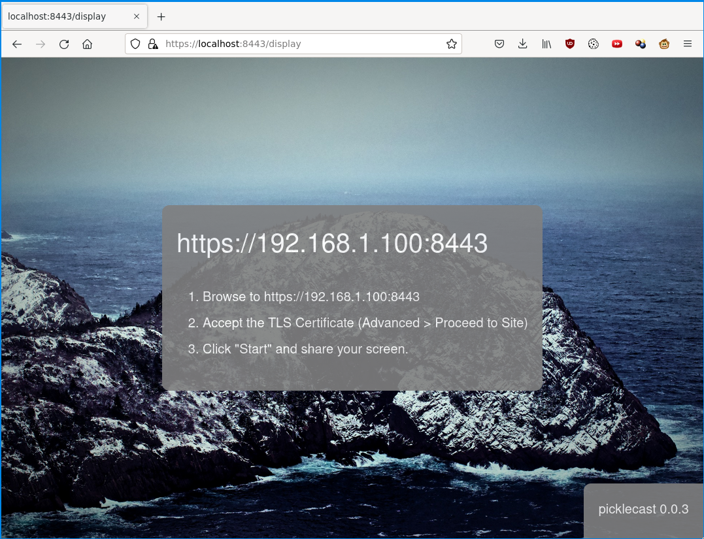

# picklecast - Simple Screen Cast Receiver

Screen share to a RaspberryPi or display computer connected to a projector or TV.

## Quickstart

Install and start the server on the display computer or RPi:

    $ pip install picklecast
    $ picklecast
    Server address: 192.168.1.100
    Display URL: http://localhost:8443/display   http://192.168.1.100:8443/display
    Client URL: http://192.168.1.100:8443/
    
Then open the display URL in a web-browser on the display computer.  You can now share your screen from a personal device by visiting the client URL.
    
Optionally install a systemd service (Linux)

    picklecast install_service ~/.config/systemd/user
    systemctl --user daemon-reload
    systemctl --user start picklecast

## How it Works

Picklecast is just a Python program that serves HTML and relays handshake messages between two browsers.  The streaming and displaying is handled in Javascript in the display/client browsers using the WebRTC api.

## Caveats

- Audio sharing only supported when sharing from Chrome on Windows ([bugzilla](https://bugzilla.mozilla.org/show_bug.cgi?id=1541425)).
